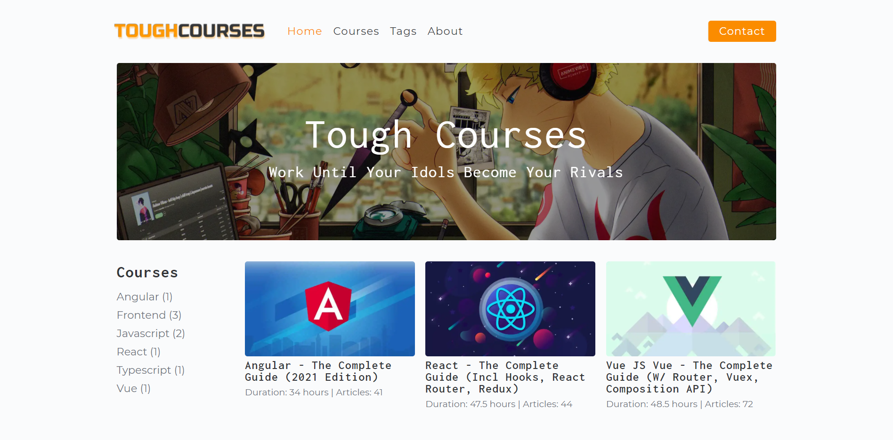
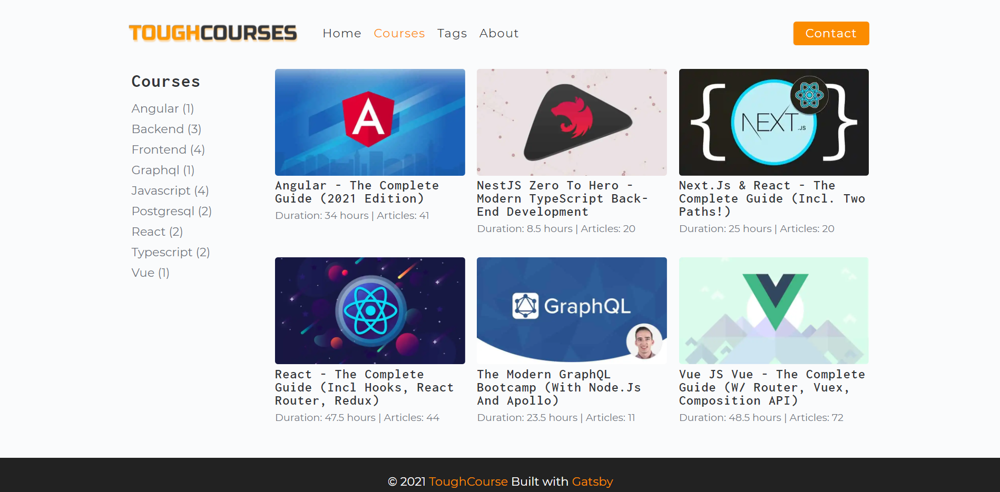
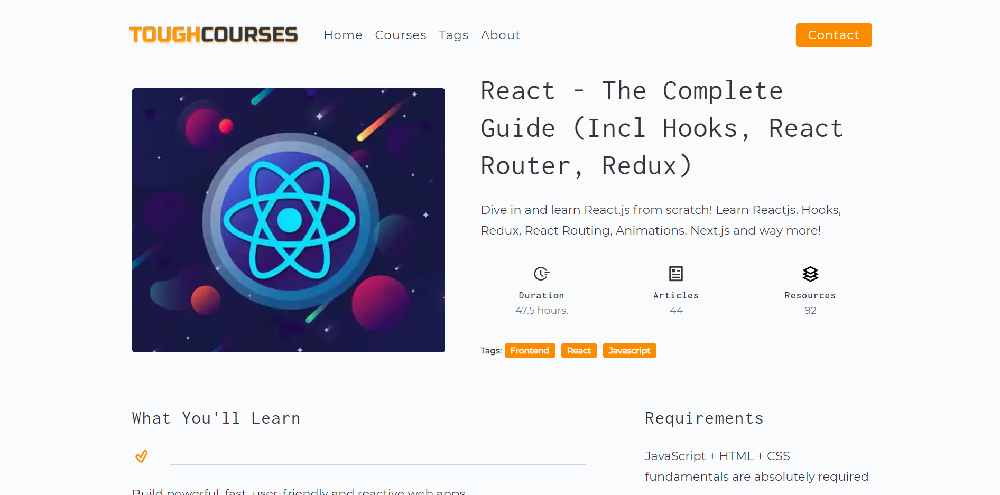
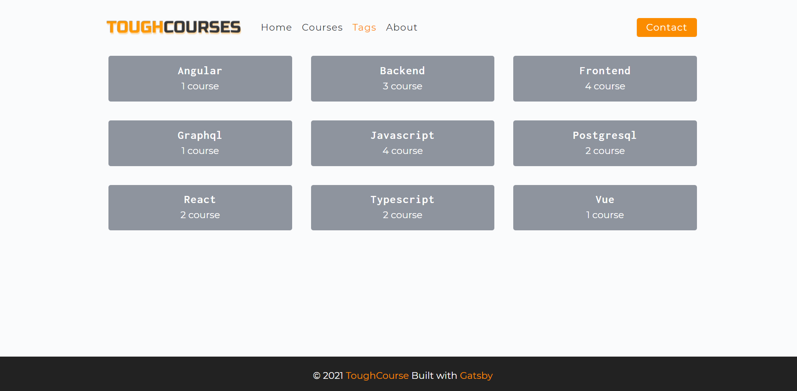

#  Tough Courses

## [Try it here](https://tough-courses.netlify.app)

## What is Tough Courses?
- A website that contains a list of my learnt Udemy courses .
- This is a static website so it's quite fast
- You can find some of links to my Google Drive that I have uploaded the courses.
- Hope you enjoy and have fun!
**Note:** In case you want to hack my website, it is not using any backend server. So dream on! 

## Technology
- Frontend
  - React - A JavaScript library for building user interfaces
  - Gatsby - The static dynamic site generator
  - Gatsby's hello-world starter - Gatsby boilerplate
- Backend
  - Contentful - Headless CMD

## Some preview images
&nbsp;
&nbsp;

## Available Scripts
- At first, you need to create `.env.development` for local and `.env.production` for production with the content of `.env.example` replaced with suitable values.

## Run in development
```
yarn start
```

## Format project
```
yarn format
```

## Build project
```
yarn build
```
# License & copyright

© Kirin Tran, FPT University TP.HCM
Licensed under the [MIT LICENSE](LICENSE).